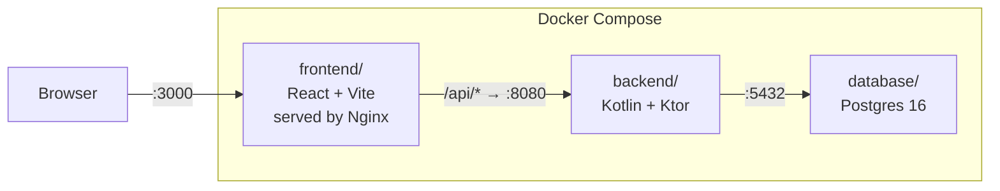

# Vibe Planner

A logistics zone planning app.

---

## 1. Running the app
First off, make sure you have docker installed in your machine.
```bash
docker compose up --build
```

Open http://localhost:3000 and log in with `test` / `V1b3Pl@nn3r!`.

### How it fits together



| Folder | What lives there |
|---|---|
| `frontend/` | React + TypeScript app, built by Vite, served by Nginx on port 3000 |
| `backend/` | Kotlin + Ktor REST API on port 8080 |
| `database/` | `init.sql` — creates tables and seeds the test user on first boot |
| `e2e/tests/` | Playwright end-to-end tests |
| `scripts/` | Helper scripts (e.g. `test-e2e.sh`) |
| `postman/` | Postman API tests collection

Nginx acts as the single entry point: static files are served directly, and anything under `/api/` is reverse-proxied to the backend (with the `/api` prefix stripped).

---

## 2. Running tests

## TEST PLAN
To see Test Plan, check `TEST_PLAN.md/`

There are two independent test suites.

### Backend — JUnit 5 + Testcontainers

Tests run against a real Postgres database spun up automatically by Testcontainers. No mocking, no in-memory fakes.

```bash
cd backend
./gradlew test
```

> **macOS + Docker Desktop:** if Testcontainers can't find Docker, prefix the command with:
> ```bash
> DOCKER_HOST=unix:///Users/$USER/.docker/run/docker.sock \
> TESTCONTAINERS_DOCKER_SOCKET_OVERRIDE=/Users/$USER/.docker/run/docker.sock \
> ./gradlew test
> ```

Test seed data lives in `backend/src/test/resources/test-seed.sql`. When you add a feature that needs new users or rows, add them there.

### E2E — Playwright

Playwright tests run against the full Docker stack. The helper script brings everything up, runs the tests against an isolated test database, then tears it all down.

```bash
./scripts/test-e2e.sh
```

The E2E suite uses a separate `vibeplanner_tests` database (via `docker-compose.test.yml`) so test runs never touch the development data.

### API Tests (Postman)

Import `postman/VibePlanner.postman_collection.json` and
`postman/VibePlanner.postman_environment.json` into Postman.

Or run via Newman:
```bash
npm install -g newman
newman run postman/VibePlanner.postman_collection.json \
  -e postman/VibePlanner.postman_environment.json
